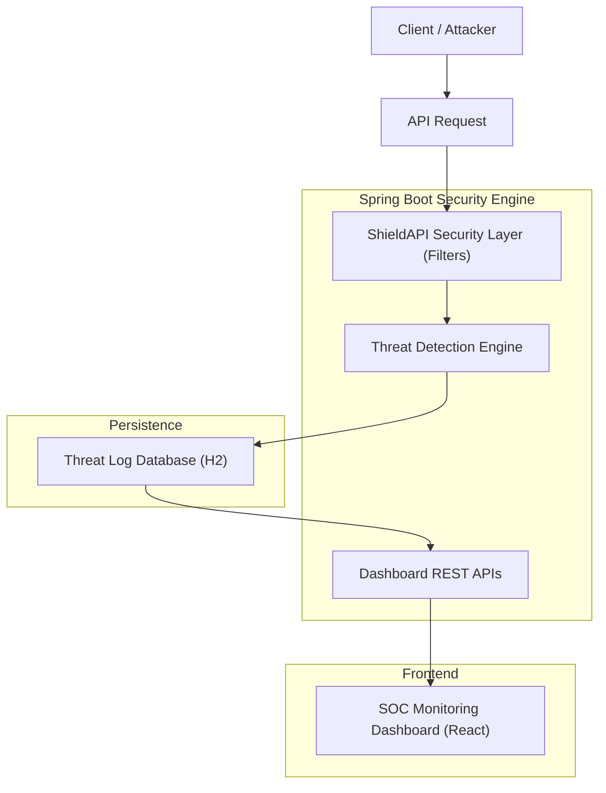

# ShieldAPI: Intelligient API Security & Monitoring 🛡️🚀

ShieldAPI is an intelligent API security and threat monitoring platform that detects malicious traffic patterns such as SQL injection, XSS attacks, brute-force attempts, and reconnaissance scans. The system includes a Spring Boot security engine and a real-time SOC dashboard that visualizes attack activity, traffic analytics, and threat intelligence.

## ✨ Key Features

- **Layered Security Pipeline**: Multi-stage filtering process including IP reputation, rate limiting, and JWT authentication.
- **Intelligent Threat Detection**: Identifies malicious patterns like SQLi, XSS, and Brute Force in real-time.
- **SOC Command Center**: A premium React-based dashboard for real-time security monitoring.
- **Automated Mitigation**: Dynamic IP blacklisting and firewall enforcement based on risk thresholds.
- **Traffic Analytics**: Detailed time-series visualization of traffic vs. attacks.

## 🛠️ Technology Stack

- **Backend**: Spring Boot 3.4, Spring Security, JPA, H2 Database
- **Frontend**: React, Vite, TailwindCSS, ShadCN UI, Framer Motion
- **Monitoring**: Recharts, Lucide Icons, WebSocket (for live events)

## 📐 ShieldAPI Architecture

The system follows a high-performance, non-blocking security architecture:



### Request Flow
1. **Client** sends request to API.
2. **ShieldAPI security layer** inspects headers, payloads, and reputation.
3. **Threat detection engine** identifies malicious patterns (SQLi, XSS, etc.).
4. **Attack is logged** into the H2 database for auditing and dashboarding.
5. **Dashboard APIs** aggregate and expose metrics (RPM, Latency, Risk).
6. **React SOC dashboard** visualizes the data in real-time.

## 🚀 Running the Project

### 1. Start the Backend
Navigate to the `shieldapi` directory and run:
```bash
./mvnw clean spring-boot:run
```
The backend will be available at `http://localhost:8080`.

### 2. Start the SOC Dashboard
Navigate to the `shieldapi-dashboard` directory and run:
```bash
npm install
npm run dev
```
The dashboard will be available at `http://localhost:3000`.

### 3. Open the Dashboard
Visit `http://localhost:3000` in your browser. You should see the **SOC Command Center** in "Backend Live" mode.

## 🕵️‍♂️ Simulating Attacks (Demo Mode)

To verify the detection and visualization capabilities, you can trigger simulated attacks using the following endpoints:

| Attack Type | Simulation Endpoint |
| :--- | :--- |
| **SQL Injection** | `GET /api/simulate/sql` |
| **XSS Attack** | `GET /api/simulate/xss` |
| **Brute Force** | `GET /api/simulate/bruteforce` |
| **Recon Scan** | `GET /api/simulate/recon` |

Upon calling these, the attacks will **immediately appear** in the dashboard activity feed and the "Active Threats" KPI.

---
*Developed for high-performance API security demonstrations.*
