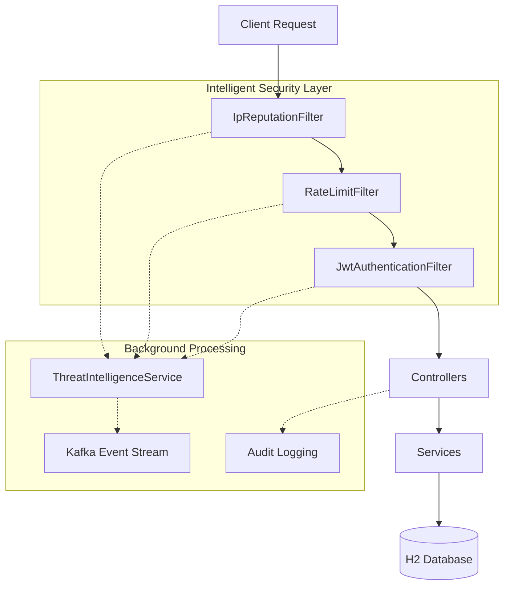

# ShieldAPI Architecture Overview

ShieldAPI is an intelligent security gateway designed to protect backend services through a layered defense-in-depth approach. It integrates real-time monitoring, automated threat mitigation, and event streaming.

## High-Level Architecture

The system follows a sequential processing pipeline where every request is validated against multiple security layers before reaching the application logic.

### Request Flow Diagram

## Core Architectural Layers

### 1. Security Filter Chain
The primary entry point for all requests. Built on Spring Security, it enforces:
- **IP Reputation**: Immediate rejection of blacklisted IP addresses.
- **Adaptive Rate Limiting**: Request throttling based on client IP to prevent DoS attacks.
- **Identity & Access**: Stateless JWT validation to ensure only authorized users access protected resources.

### 2. Threat Detection Pipeline
An asynchronous engine that monitors for suspicious patterns:
- **Event Correlation**: Linking multiple failures (e.g., auth failures + rate limit hits) to a single source.
- **Dynamic Scoring**: Incrementing threat scores based on action severity.
- **Automated Mitigation**: Triggering IP blocks when threat thresholds are exceeded.

### 3. Analytics & Monitoring
Real-time visibility into system health:
- **Security Analytics**: Dedicated endpoints for administrators to view threat summaries and attack patterns.
- **Audit Trails**: Detailed request/response logging for compliance and forensic analysis.
- **Kafka Streaming**: Real-time event export to external SIEM/SOAR platforms.

### 4. Persistence Layer
Uses Spring Data JPA with an H2 database for storing:
- Blocked IP lists
- Historical threat events
- System audit logs
- User and role configurations
